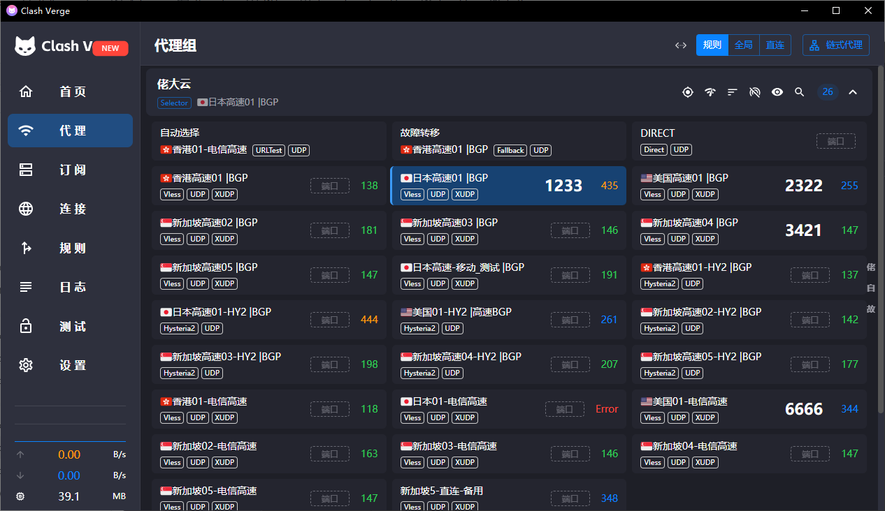
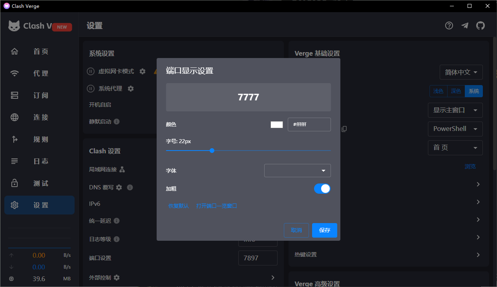
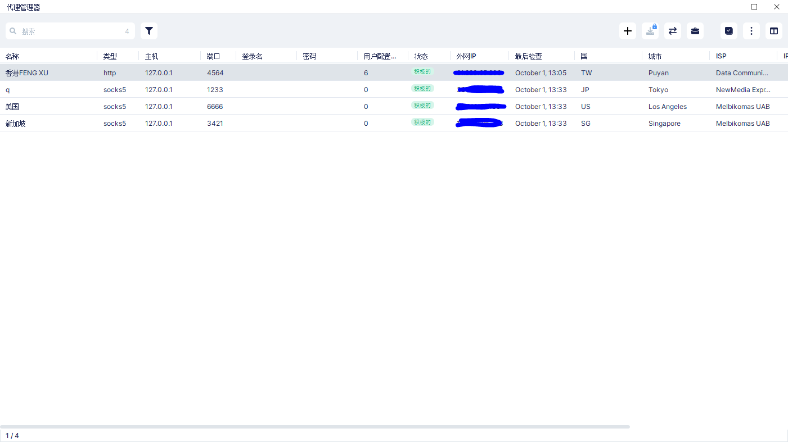

<h1 align="center">
  
  <br>
  🚀Socks5 <a href="https://github.com/zzzgydi/clash-verge">Clash Verge</a>
  <br>
</h1>

<p align="center">
  Languages:
  <a href="./README.md">简体中文</a> 
</p>

## Install

请到发布页面下载对应的安装包：[Release page](https://github.com/laicai114514-tech/clash-verge-rev-have-socks5/releases)
目前只有 Windows 版本

#### 安装说明和常见问题，请到 [文档页](https://clash-verge-rev.github.io/) 查看

## Preview

本版本跟 官方 Clash verge 有什么**改动**

适合那些做指纹浏览器，追求隐私保护的人，本地配置socks5端口，每个配置一个节点，不必每次使用都切换，更不会**切错节点**。

如图所示

**代理列表可以填写多本地端口**
  

**设置-端口显示设置可以调节字体大小，颜色等**
  

**指纹浏览器如图**
  

---

## Promotion

### ✈️ [佬大云 -- 性价比机场 ClaudeBorder](https://laodayun.net)

- 💻 多种套餐可选择，**大众**，**专线**，**家宽**。
- 🗺 全**高速稳定**正价节点。
- 🌏 **海外团队**，不跑路。
- 💰 极致**稳定**，亲民价**价格**
- 🌐 全面支持**流媒体及各AI访问**
- 🙋 7*12小时真人客服。解决您的各类问题。

---

## Features

- 基于性能强劲的 Rust 和 Tauri 2 框架
- 内置[Clash.Meta(mihomo)](https://github.com/MetaCubeX/mihomo)内核，并支持切换 `Alpha` 版本内核。
- 简洁美观的用户界面，支持自定义主题颜色、代理组/托盘图标以及 `CSS Injection`。
- 配置文件管理和增强（Merge 和 Script），配置文件语法提示。
- 系统代理和守卫、`TUN(虚拟网卡)` 模式。
- 可视化节点和规则编辑
- WebDav 配置备份和同步

## Development

See [CONTRIBUTING.md](./CONTRIBUTING.md) for more details.

To run the development server, execute the following commands after all prerequisites for **Tauri** are installed:

```shell
pnpm i
pnpm run prebuild
pnpm dev
```

`pnpm dev` preserves the Development Channel's installed service state: an
existing service is used, while a previously uninstalled service remains
uninstalled and the app starts in Sidecar mode. Use `pnpm dev:service` to
explicitly install or update the isolated development service before launch,
or `pnpm dev:sidecar` to force the unprivileged Sidecar workflow.

## Contributions

Issue and PR welcome!

## Acknowledgement

Clash Verge rev was based on or inspired by these projects and so on:

- [zzzgydi/clash-verge](https://github.com/zzzgydi/clash-verge): A Clash GUI based on tauri. Supports Windows, macOS and Linux.
- [tauri-apps/tauri](https://github.com/tauri-apps/tauri): Build smaller, faster, and more secure desktop applications with a web frontend.
- [Dreamacro/clash](https://github.com/Dreamacro/clash): A rule-based tunnel in Go.
- [MetaCubeX/mihomo](https://github.com/MetaCubeX/mihomo): A rule-based tunnel in Go.
- [Fndroid/clash_for_windows_pkg](https://github.com/Fndroid/clash_for_windows_pkg): A Windows/macOS GUI based on Clash.
- [vitejs/vite](https://github.com/vitejs/vite): Next generation frontend tooling. It's fast!

## Privacy

Clash Verge Rev 不收集任何用户数据，配置与日志仅保存在本地。详见[隐私政策](./PRIVACY.md)。

Clash Verge Rev does not collect any user data; configuration and logs stay on
your own device. See the [Privacy Policy](./PRIVACY.md) for details.

## License

GPL-3.0 License. See [License here](./LICENSE) for details.
