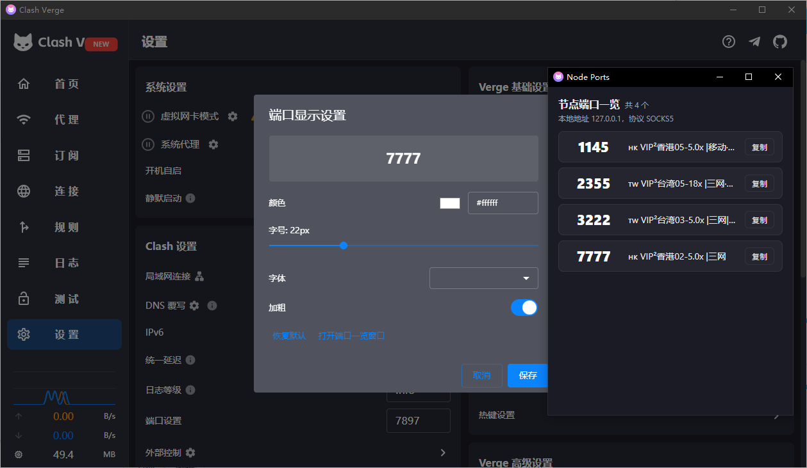

<h1 align="center">
  
   
  🚀Socks5 <a href="https://github.com/zzzgydi/clash-verge">Clash Verge</a>
   
</h1>

  Languages:
  <a href="./README.md">简体中文</a> 

## Install

请到发布页面下载对应的安装包：[Release page](https://github.com/laicai114514-tech/clash-verge-rev-have-socks5/releases)

#### 安装说明和常见问题，请到 [文档页](https://clash-verge-rev.github.io/) 查看

## Preview

本版本跟 官方 Clash verge 有什么**改动**

适合那些做指纹浏览器，追求隐私保护的人，本地配置socks5端口，每个配置一个节点，不必每次使用都切换，更不会**切错节点**。

如图所示

**代理列表可以填写多本地端口**
  

**设置-端口显示设置可以调节字体大小，颜色等**
**显示节点对应端口的窗口**
  
 
**指纹浏览器如图**
  

---

## Promotion

### ✈️ [佬大云 -- 性价比机场 ClaudeBorder](https://laodayun.net)

- 💻 多种套餐可选择，**大众**，**专线**，**家宽**。
- 🗺 全**高速稳定**节点。
- 🌏 **海外团队**，不跑路。
- 💰 极致**稳定**，亲民价**价格**
- 🌐 全面支持**流媒体及各AI访问**
- 🙋 7*12小时真人客服。解决您的各类问题。

---

## Features

- 基于性能强劲的 Rust 和 Tauri 2 框架
- 内置[Clash.Meta(mihomo)](https://github.com/MetaCubeX/mihomo)内核，并支持切换 `Alpha` 版本内核。
- 简洁美观的用户界面，支持自定义主题颜色、代理组/托盘图标以及 `CSS Injection`。
- 配置文件管理和增强（Merge 和 Script），配置文件语法提示。
- 系统代理和守卫、`TUN(虚拟网卡)` 模式。
- 可视化节点和规则编辑
- WebDav 配置备份和同步
